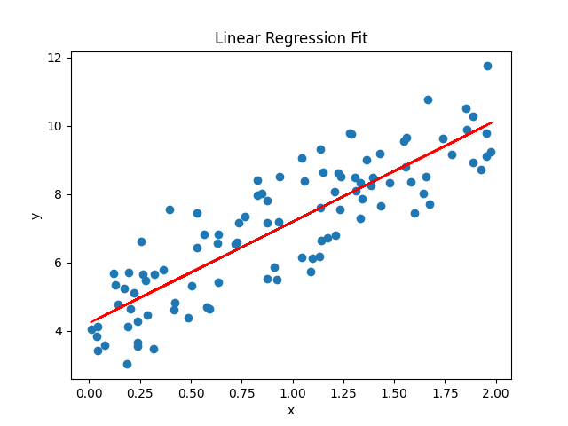
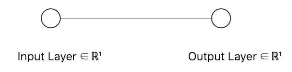

# 回归算法

### 1. 线性回归

​	   **线性回归 (Linear Regression) 是一种用于预测连续值的最基本的机器学习算法，它假设目标变量 y 和特征变量 x 之间存在线性	关系，并试图找到一条最佳拟合直线来描述这种关系。**

####  	1. 前向传播(Forward Propagation)

---

​		**网络结构：**

​		

---

​		**目标：给出一组数据$\mathbf{X}, \mathbf{Y}\in\mathbb{R}$，每对数据呈正相关。求出一个函数使其尽可能拟合数据集**

---



​		由于其关系为正相关，我们设计一个单层(**Single-Layer**)的神经网络。期望经过训练后，使其能表示一个线性关系。

---



   ##### 			1. 了解在Input Layer与Output Layer之间的函数

​			$f(x) = wx+b$，其中$w, b$是我们需要调整的参数

  ##### 			2.激活函数

​			由于案例仅仅只需要表示一个线性关系，自然不需要非线性激活函数。

​			非线性激活函数引入非线性映射，使神经网络能够学习和表示复杂的函数关系。

​			**主流的非线性激活函数：**

​				1.$Sigmoid(x) =\Large \frac{1}{1-e^{-x}}$

​				2.$Relu(x)=max(0, x)$

​				3.$Softmax(x) =\Large \frac{e^{xi}}{\sum_ie^{xi}}$

​				4.$Tanh~x \Large={\frac{sinh~x}{cosh~x}}={\frac{e^x-e^{-x}}{e^x+e^{-x}}}$

##### 			3.前向传播计算

​			$Output(x) = f(x)$

​	        	1. **第一个下标 $i$：输入特征（来自前一层第$i$个神经元）。**

​	        	2. **第二个下标 $j$：当前层的第 $j$ 个神经元。**

​			其中，$a_j$表示为当前层第$j$个神经元，则这一层每个神经元的前向传播表达式为：

​					$\large a_j = \sum^n_{i=1}w_{ij}x_i+b_j$

​			可得$Output(x) = wx+b$

---

#### 	2. 反向传播(Back Propagation)

​		*反向传播算法利用链式法则，通过从输出层向输入层逐层计算误差梯度，求解神经网络参数的偏导数，以实现网络参数的		调整优化和损失函数的最小化*

---

#####				1. 链式法则(Chain Rule)

​			***链式法则是微积分中的一个基本定理，用于计算复合函数的导数。如果一个函数是由多个函数复合而成，那么该复合函			数的导数可以通过各个简单函数导数的乘积来计算。***

​			即:

​				$\large [f(g(x))]'=f'(g(x))\times g'(x)$

​			推导过程:


$$
\begin{aligned}
&\text{令 } h = g(x)\text{，则当 } \Delta x \to 0 \text{ 时，} g(x) \to g(x+\Delta x): \\
&\quad \Delta h = g(x+\Delta x) - g(x), \\
&\quad g(x+\Delta x) = h + \Delta h
\end{aligned}
$$
​								$$\begin{aligned}
[f(g(x))]' &= \lim_{\Delta x \to 0} \frac{f(g(x + \Delta x)) - f(g(x))}{\Delta x} \times \frac{g(x + \Delta x) - g(x)}{g(x + \Delta x) - g(x)} \\
&= \lim_{\Delta x \to 0} \frac{f(g(x + \Delta x)) - f(g(x))}{g(x + \Delta x) - g(x)} \times \frac{g(x + \Delta x) - g(x)}{\Delta x} \\
&= \lim_{\Delta x \to 0} \frac{f(h + \Delta h) - f(h)}{\Delta h} \times \frac{g(x + \Delta x) - g(x)}{\Delta x} \\
&= f'(g(x)) \times g'(x)
\end{aligned}
$$

---

##### 2.损失函数(Loss Function)

​			***损失函数是用于计算期待值$~\large y~$与实际值$~\large\overline{y}~$之间的误差的函数，用于衡量模型对数据集的拟合程度***

​			*一般有以下在回归问题较为通用的损失函数*：

​				$1.均方误差(Mean~Squared~Error):$

​					$MSE\large=\frac{1}{n}\sum^n_{i=1}(y_i-\overline y_i)^2$

​				$2.平均绝对误差(Mean~Absolute~Error):$

​					$MAE\large=\frac{1}{n}\sum^n_{i=1}|y_i-\overline y_i|$

​				**$3.Huber损失函数$**

​					使用 **Huber Loss** 作为激活函数，对离群点仍然有很好的抗干扰性。其中$~\delta~$为超参数，用于分离对于误差大时和					误差小时的损失计算。		

​					$$\begin{aligned}
L_\delta(y, \overline{y}) = \left\{
\begin{aligned}
&\frac{1}{2}(y - \overline{y})^2, && \text{if } |y - \overline{y}| \le \delta, \\
&\delta |y - \overline{y}| - \frac{1}{2}\delta^2, && \text{if } |y - \overline{y}| > \delta.
\end{aligned}
\right.
\end{aligned}$$

##### 3.对w和b求偏导

​						**样例使用MSE损失函数。**

---

$则定义L为损失函数,\\由于我们需要计算w和b对于L函数产出的影响,我们需要对w和b分别求偏导\frac{\partial L}{\partial w}与\frac{\partial L}{\partial b},~根据链式法则:$

$\large对于w的梯度:\begin{aligned}~\frac{\partial L}{\partial w}&=\frac{\partial}{\partial w}[(y-f(x))^2]\\
&=2(y-f(x))\times \frac{\partial}{\partial w}(y-f(x))\\
&=2(y-f(x))\times(\frac{\partial y}{\partial w}-\frac{\partial f}{\partial w})\\
&=2(y-f(x))\times(0-x)\\
&=-2x(y-f(x))\end{aligned}~~对于b的梯度:\begin{aligned}~\frac{\partial L}{\partial b}&=\frac{\partial}{\partial b}[(y-f(x))^2]\\
&=2(y-f(x))\times \frac{\partial}{\partial b}(y-f(x))\\
&=2(y-f(x))\times(\frac{\partial y}{\partial b}-\frac{\partial f}{\partial b})\\
&=2(y-f(x))\times(0-1)\\
&=-2(y-f(x))\end{aligned}$

$则我们可以得到对于w与b的调整方程。~当然,~为取得损失函数极小值,我们需要分别将w,~b向\large{\frac{\partial L}{\partial w}},~\large{\frac{\partial L}{\partial b}} ，$$的负方向进行调整。$
$\textbf {另外,~我们还需要一个超参数}\eta\textbf {,~即学习率,~学习率控制模型训练时的拟合效率与精度,~取值一般在}[0, 1]$

​										$\large w = w-\frac{\partial L}{\partial w}\\\large b = b-\frac{\partial L}{\partial b}\\\large则我们总结一下对于w与b的调整方程:\\
w=w-[-2x(y-f(x))]\\b=w-[-2(y-f(x))]$

---

### 总结

​	***回归问题的案例是一个较为简单的问题，一般用于拟合拥有一定规律的复杂函数。其核心是通过先正向传播，将拟合结果输出后用Loss Fuction计算其误差值，为求得Loss Fuction的极小值，我们需要的到w与b和误差函数之间的变化关系，再将Loss Fuction向前对每个神经元运用链式法则(Chain rule)对w与b做偏导，以计算出调整的方向与大小***

---

### 示例代码

``````python
import numpy as np
import matplotlib.pyplot as plt

LearningRate = 0.1

rw, rb = 4, 3 #y = 4x+3
x_sc = 2 * np.random.rand(100, 1)
y_sc = rb + rw * x_sc + np.random.randn(100, 1)

plt.scatter(x_sc, y_sc)
plt.title("Linear Regression")

w, b = 0, 0
for epoch in range(100):
    y_pred = w * x_sc + b
    dw = -(2/len(x_sc)) * np.sum(x_sc * (y_sc-y_pred))
    db = -(2/len(x_sc)) * np.sum(y_sc - y_pred)
    w -= LearningRate * dw
    b -= LearningRate * db

plt.plot(x_sc, w*x_sc+b, color='red')
plt.show()
``````


​			


​			

​	


